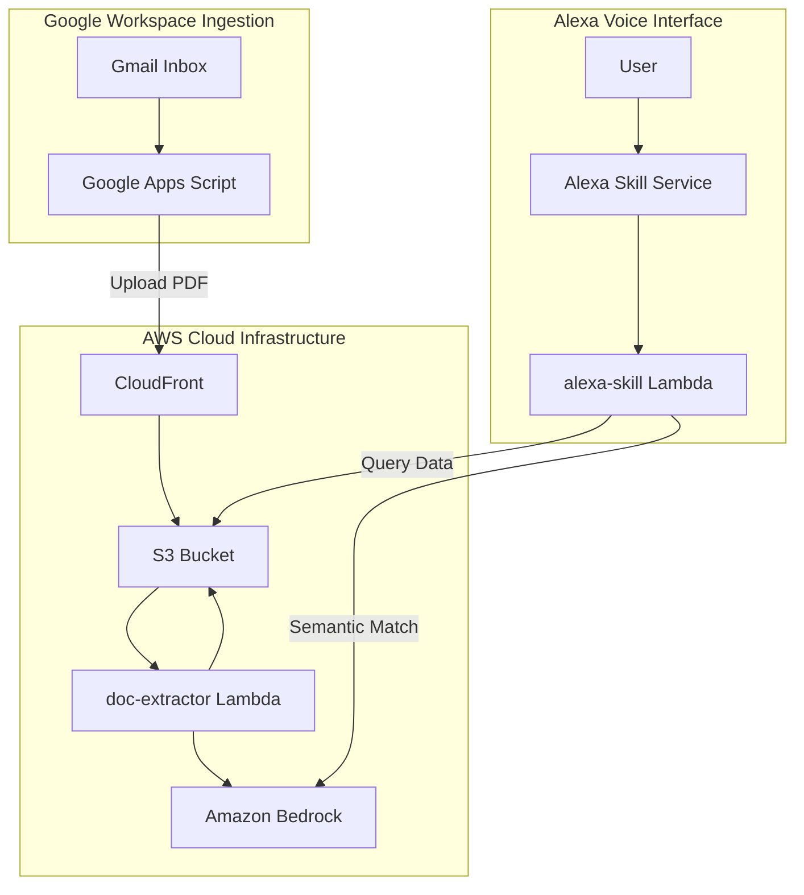

# School Assistant

School Assistant is an automated tool using AI to help parents keep track of busy school schedules.

Instead of manually checking emails and copying dates, this system automates the process. Whenever your school sends a PDF newsletter or weekly bulletin, a background script intercepts it and uploads it to an AWS backend. The system reads the PDF and extracts all mentioned events and dates (such as sports days, class discos, or holidays) using artificial intelligence. You can then simply ask Alexa about upcoming events (e.g., _"Alexa, open school. What's happening tomorrow?"_ or _"When is the school play?"_), and it will query the extracted schedule for you.

The application runs serverless on AWS (deployed via CDK) and utilizes AI on Amazon Bedrock to parse documents and search events.

> **Warning:** AI data extraction is not perfect, so this system will get things wrong sometimes.

---

## Architecture Overview



### How It Works Under the Hood

1. **Ingestion**: A Google Apps Script polls your Gmail inbox for school newsletter emails, extracts PDF attachments, and uploads them to a S3 bucket.
2. **Extraction**:
   - The upload triggers the `doc-extractor` Lambda.
   - The Lambda computes the MD5 hash of the PDF. If the hash matches the previous upload, processing is skipped.
   - If the PDF has changed, the Lambda checks the page count. For documents within the limit (default `<= 4` pages), it performs full visual AI extraction by passing the PDF bytes to Bedrock (using your configured extraction model). For longer documents, it extracts the text locally first to minimize Bedrock usage costs and then sends the text for parsing.
   - The output is stored in S3 as JSON data.
3. **Alexa Interface**: When you ask Alexa about school events, the `alexa-skill` Lambda queries the compiled data in S3 using Bedrock (using your configured query model) to find relevant event matches for your search query.

> **Note:** The choice of LLM is fully configurable for both document extraction and Alexa querying. The system is compatible with a wide variety of foundation models on Amazon Bedrock (such as Anthropic Claude Sonnet 4.6 or Claude Haiku 4.5) or other industry-standard models (like the latest GPT models via compatible API endpoints).

---

## Deployment & Setup

### Prerequisites

- **Node.js**: `>= 22`
- **pnpm**: `>= 10`
- **AWS Credentials**: Configured locally (the AWS CLI is not required; the CDK interacts directly with AWS APIs using environment variables or `~/.aws/credentials` profiles).
- **Amazon Alexa Developer Account**: Required to register and host the Alexa skill.

---

### Step 1: Configure `config.yaml`

Create a `config.yaml` file in the root directory. You can use `config-example.yaml` as a reference.

This file defines the schools/inputs you want to track:

```yaml
inputs:
  school1: # Give a sensible real name (e.g. 'infants', 'eton', or perhaps a person's name)
    extraction:
      promptId: newsletter # Reference by name one of the prompts, either from config-defaults.yaml or add a new prompt
    aliases: # List of other ways the school might be referred to (e.g. by school name or by the name of the child attending)
      - alias1
      - alias2
  #school2:
  # etc
```

> **Note:** The input keys (e.g., `school1`) are used as path parameters for uploads. The files will be uploaded to `<uploadEndpoint>/<inputId>/input.pdf`.

---

### Step 2: Get Alexa Developer Credentials

To allow AWS CDK to register and update the Alexa skill on your behalf, you must obtain Alexa developer credentials:

1. Go to the [Amazon Developer Console](https://developer.amazon.com/) and register for an Alexa Developer account.
2. Create a **Login with Amazon (LWA)** security profile:
   - Go to **Developer Console** > **Settings** > **Security Profiles**.
   - Create a new Profile.
   - Under the **Web Settings** tab of your profile, add `http://localhost:3000` (or another port you plan to use) to **Allowed Return URLs** if required by the login CLI.
   - Save the **Client ID** and **Client Secret**.
3. Generate the **Refresh Token**:
   - Generate LWA tokens using `pnpm dlx`:
     ```bash
     pnpm dlx ask-cli utility generate-lwa-tokens --client-id <YOUR_CLIENT_ID> --client-secret <YOUR_CLIENT_SECRET>
     ```
   - Follow the instructions in the browser window that opens. This will output a `refreshToken` in your terminal.
4. Get your **Vendor ID**:
   - Go to **Developer Console** > **Settings** > **Customer Profile** (or find it on the Alexa developer homepage) and copy your **Vendor ID**.

---

### Step 3: Configure `.env`

Create a `.env` file in the root of the project using the template from `.env.dummy`:

```env
STACK_NAME=school-calendar
UPLOAD_AUTH_PASSWORD=your-secure-upload-password-here
NOTIFICATION_EMAIL=your-email@example.com
BANNED_REGIONS=eu-*,ap-*

# Alexa Developer Credentials
ALEXA_VENDOR_ID=your-alexa-vendor-id
ALEXA_CLIENT_ID=amzn1.application-oa2-client.your-client-id
ALEXA_CLIENT_SECRET=amzn1.oa2-cs.v1.your-client-secret
ALEXA_REFRESH_TOKEN=your-refresh-token

# Initially leave AMZN_SKILL_ID blank. You will update this after the first deploy.
AMZN_SKILL_ID=
```

- **`UPLOAD_AUTH_PASSWORD`**: A secure token of your choice. It will be verified by a CloudFront Function on every PDF upload.
- **`NOTIFICATION_EMAIL`**: The email address where you want to receive SNS alert notifications if a Lambda execution fails.
- **`BANNED_REGIONS`**: Region wildcard patterns to restrict AWS Bedrock model invocation permissions (to prevent usage in undesired jurisdictions).

---

### Step 4: Deploy the CDK Stack (Initial Pass)

1. Install project dependencies:
   ```bash
   pnpm install
   ```
2. Bootstrap CDK in your AWS account and region (if you haven't already):
   ```bash
   pnpm exec cdk bootstrap
   ```
3. Run the initial deploy:
   ```bash
   pnpm run deploy
   ```
4. Note down the **Outputs** printed in the terminal:
   - **`uploadEndpoint`**: The HTTPS URL of the CloudFront distribution (e.g., `https://d123456abcdef8.cloudfront.net/`). This will be used in your Google Apps Script.
5. Retrieve the **Alexa Skill ID**:
   - Go to the [Alexa Developer Console](https://developer.amazon.com/alexa/console/ask).
   - Under the list of your skills, locate the newly created "School Assistant" skill.
   - Copy its **Skill ID** (looks like `amzn1.ask.skill.xxxxxx-xxxx-xxxx-xxxx-xxxxxxxxxxxx`).

---

### Step 5: Update and Redeploy (Final Pass)

To prevent circular dependencies during the initial deployment, the Lambda permission restriction on the Alexa Skill ID is omitted. Now that the skill exists, you should secure the endpoint.

1. Open your `.env` file and set:
   ```env
   AMZN_SKILL_ID=amzn1.ask.skill.xxxxxx-xxxx-xxxx-xxxx-xxxxxxxxxxxx
   ```
2. Redeploy the CDK stack:
   ```bash
   pnpm run deploy
   ```

This updates the Alexa-skill Lambda permissions to only allow invocation requests originating from your specific Alexa Skill.

---

## Ingesting Newsletters (Google Apps Script Setup)

The repository includes a Google Apps Script in the `google-apps-script` folder that automatically polls Gmail for new newsletter emails and forwards PDF attachments to your AWS upload endpoint.

### Installation & Configuration

1. Go to [Google Apps Script](https://script.google.com/) and create a new project.
2. Replace the contents of the default script file (`Code.gs`) with the code from [Code.gs](google-apps-script/Code.gs).
3. Open the **Project Settings** (gear icon) and check the box for **"Show 'appsscript.json' manifest file in editor"**.
4. Open the `appsscript.json` file in the editor and replace its contents with [appsscript.json](google-apps-script/appsscript.json) (this configures the necessary OAuth scopes for Gmail read access, external requests, and trigger creation).
5. In your Google Apps Script (`Code.gs`), configure the following variables at the top of the file:
   - **`POST_URL`**: Set to the `uploadEndpoint` from the CDK deploy output (must end with a trailing `/`).
   - **`UPLOAD_AUTH_PASSWORD`**: Must match the exact `UPLOAD_AUTH_PASSWORD` configured in your `.env`.
   - **`CONFIGS`**: Define the search filters for each school. Ensure that the `inputId` matching each filter corresponds exactly to the keys defined under `inputs` in your `config.yaml`.
     ```javascript
     const CONFIGS = [
     	{
     		searchQuery: `${BASE_searchQuery} from:(office@school1.com)`,
     		emailSubjectRegex: /Newsletter.*/i,
     		attachmentRegex: /School Newsletter .*\.pdf$/i,
     		inputId: 'school1' // Matches 'school1' under 'inputs' in config.yaml
     	}
     ]
     ```
6. Run the `createHourlyTrigger` function in the Apps Script editor. This will authorize the script and set up a time-driven trigger to automatically scan your email hourly.

---

## Interacting with the Alexa Skill

Once the stack is deployed and the skill is active, you can test it on any Alexa-enabled device linked to your developer account, or via the **Test** tab in the Alexa Developer Console.

The default invocation name is **"school"** (configured in [en-GB.json](skill-package/interactionModels/custom/en-GB.json)).

### Example one-shot voice Commands

- _"Alexa, ask school what's happening today"_
- _"Alexa, ask school when is the disco"_

### Using the Skill interactively

- _"Alexa, open school"_
  - **Response**: _"Welcome to School Assistant. You can ask about events on a specific date or search for a specific event by name. How can I help?"_

#### Querying Events by Date

- _"What is happening on Friday?"_
- _"What is happening tomorrow?"_
- _"Is there anything on the 10th of October?"_
- _"Do I have anything happening next Monday?"_

#### Querying Events by Name (Semantic Search)

- _"When is the disco?"_
- _"When is the school play?"_
- _"How long until the summer fair?"_
- _"When is my sports day?"_

---

## Development & Testing

- To run unit tests:
  ```bash
  pnpm run test:unit
  ```
- To run CDK tests:
  ```bash
  pnpm run test:cdk
  ```
- To test the PDF text extractor locally on a sample file:
  - Place a PDF at `./input.pdf`.
  - Run:
    ```bash
    node tools/run-pdf-extract.js
    ```
